# Lars T. Lih

## Lenin Rediscovered: _What Is to Be Done?_ in Context (2008)
### hoofdstuk 1 
door ☭kiara♡ (輝愛来)

---
# [Lars T. Lih](imgs/https://weeklyworker.co.uk/worker/authors/lars-t-lih/)
- adjunct-professor muziekgeschiedenis @ McGill U
- Ph.D. Political Science (1984 @ Princeton): _Bread and Authority in Russia, 1914—1921_
- Marxistisch historicus ([boeken](imgs/https://amazon.com/stores/Lars-T.-Lih/author/B001HCXNOA), [academische artikelen](imgs/https://scholar.google.com/scholar?q=lars+lih), [Jacobin](imgs/https://jacobin.com/author/lars-t-lih))
- [communistuniversity.uk](imgs/https://communistuniversity.uk/)

---
# plagiaat?? 🥺
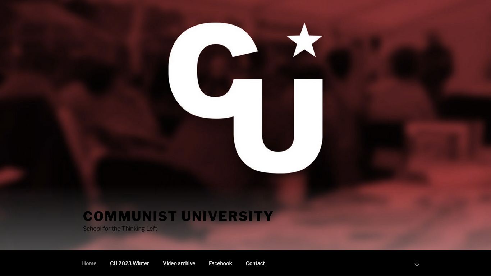

---
# het boek
- vertaling + commentaar _What is to be done_ (Lenin, 1901)
- doel:
    - hernieuwd begrip geven van Lenin
      - textbook frame
      <!-- - zorg of arbeiders wel revolutie willen -->
      <!-- - proto-Stalinisme -->
      <!-- - top-down uit gecentraliseerde partij revolutie stoken -->
      <!-- - handvest van Bolsjevisme -->
      <!-- - cancel soc-dems (Mensjevieken) -->
    - eigen antwoorden van auteur uitleggen over Lenin's vragen

---
# _What is to be done_

---
# _What is to be done_
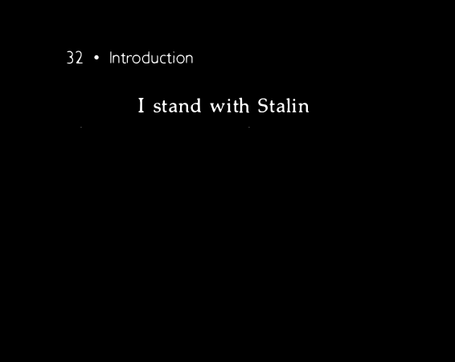

---
# _What is to be done_
- tijdelijk, toch textbook status
- pseudoniem: Lenin
- 1901 tsarist Rusland

---
<!-- ## The Merger of Socialism and the Worker Movement -->
## De fusie van socialisme en de arbeiders-beweging
<!-- source: https://dragonball.fandom.com/wiki/Fusion_Saga -->

---
# Marx
> de overname van de politieke macht door het proletariaat

<!-- # socialisten > chartisten -->
<!-- - Chartisten -->
<!-- - socialistische agitatie -->
<!-- 
### vijanden
- reactionaire socialisten
- kleinburgers
---
# machtsovername: 
benodigdheden:
- arbeiders
- **politieke vrijheden**
- propaganda
 -->

---
# Lasalle
<!-- source: http://upload.turkcewiki.org/wikipedia/commons/thumb/0/0f/Bundesarchiv_Bild_183-R66693%2C_Ferdinand_Lassalle.jpg/300px-Bundesarchiv_Bild_183-R66693%2C_Ferdinand_Lassalle.jpg -->
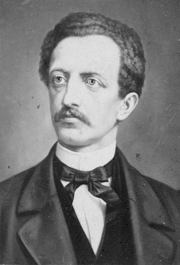
- 👍 partij!
- 😈 dictatoriaal
- 👎 wou niet zo
- 👊 trainen 
- 😘 Bismarck
- ⚔️💀

---
# Lasalle
> The great destiny of our age is precisely this &mdash; which the dark ages had been unable to conceive, much less to achieve &mdash; the **dissemination of scientific knowledge** among the body of the people 🤌🤌

---
# SPD (1875-)
<!-- source: http://library.fes.de/parteitage/jpg/fb002293-35pc.jpg -->
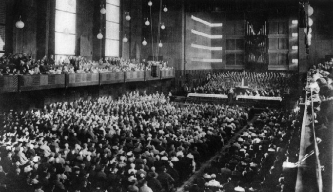
- 🇩🇪🏟️ groot
- 🗞️ georganiseerd
- tribune v/h volk
- 😕 marxistisch (ish)
- 😿 democratisch (ish)

---
## SPD: arbeider centraal
- **arbeider**sklasse
- **arbeider**sbeweging
- **arbeider**spartij
- **arbeider**s...vereniging
- ...

---
## Kautsky's _Erfurt Programma_
<!-- source: https://mronline.org/2014/images/erfurter_programm.jpg -->
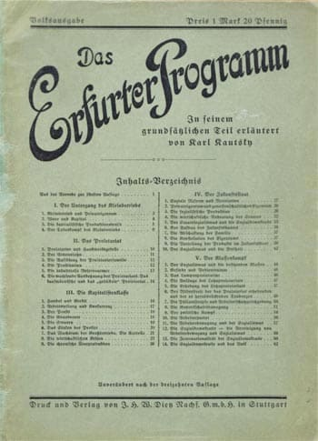
- door Lenin vertaald
- fusie formule
- cirkels van bewustzijn

---
### cirkels van bewustzijn
<!-- source: Lars L. Lih, Lenin Rediscovered: What Is to Be Done? in Context (2008) -->
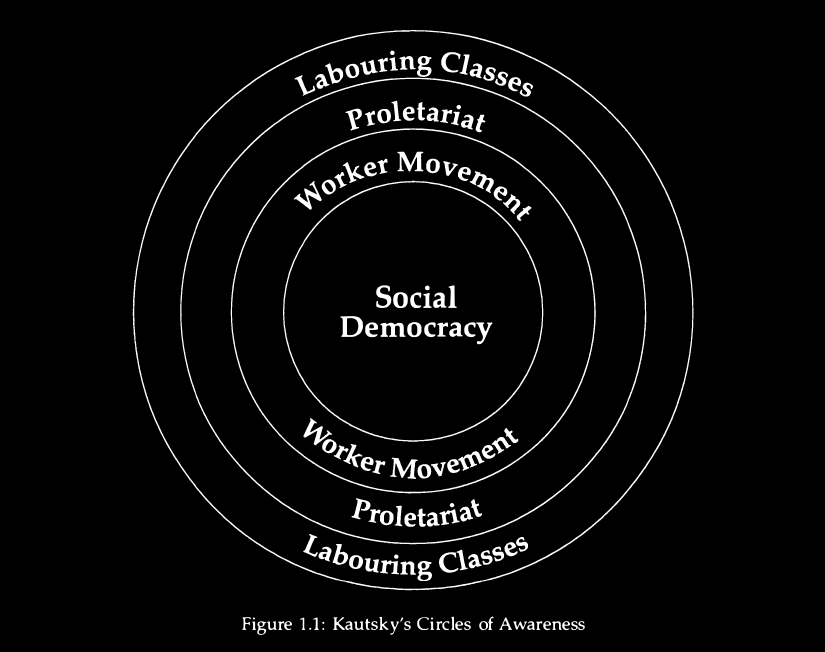
- getrapte bewustwording
- (niet ware grootte)
- uiteindelijk ∞
- gaat vanzelf ⏳ maar kan versneld 🎉
  - fusie formule

---
### cirkels van bewustzijn: vanzelf
<!-- source: https://duckduckgo.com/?q=end+of+evangelion+rei&t=ffab&iar=images&iaf=license%3AAny&iax=images&ia=images&iai=https%3A%2F%2Ffile.namu.moe%2Ffile%2Fc2790d5985eae82cd1199a4cba2101c11c298f3c52bc4a4cb86ce18adc79f2e0b08144535e751c6c764743a09221f00f -->
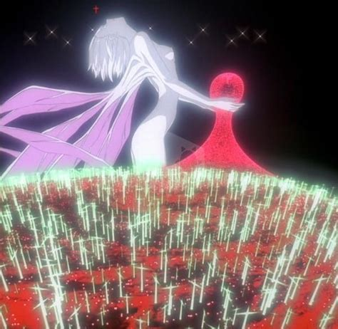
- arbeiderbeweging
- landelijke politieke arbeiderspartij
- machtsovername
- socialisme

---
# Kautsky's fusie formule
<!-- source fnv logo: fnv.nl -->
<!-- source commiecentral logo: https://twitter.com/commiecentral2/ -->
<!-- source hammer sickle star image: https://www.geeksvgs.com/files/4/89/hammer-sickle-star-color.png -->
#  + 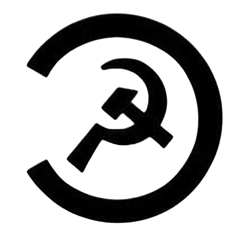 = 
<!-- socialisme + arbeiderbeweging = Sociaal Democratie -->

---
# wetenschappelijk socialisme
- toon proleet hun doel en weg
  - ≈ Marxsplaining

---
## wetenschappelijk socialisme
<!-- source img: rodelap.nl -->
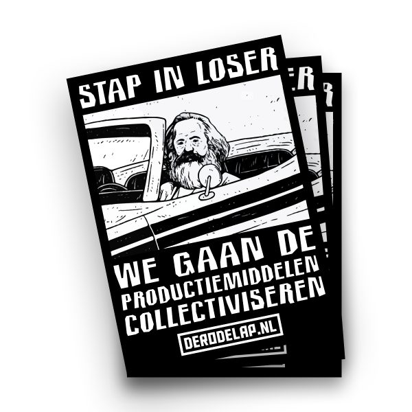
1. maak extreemlinkse propaganda
1. ???
1. niemand meer profit ☭🥳

---
## wetenschappelijk socialisme in actie
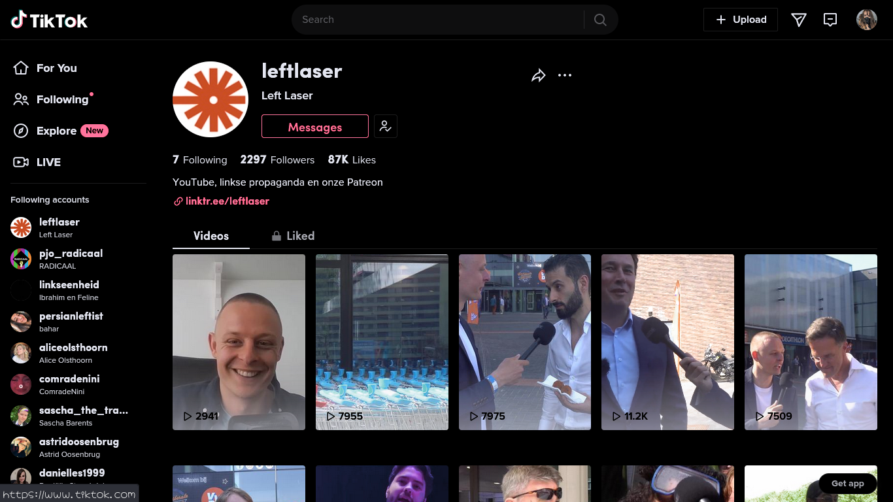

---
### uit Kautsky's fusie formule:
1. scheiding socialisme / arbeiderbeweging
1. cirkels van bewustzijn
1. noodzaak politieke vrijheid
1. zelf moeten doen
1. noodzaak volkspartij
1. kracht uit doel
1. missie Sociaal Democratie
1. strijd tegen gescheiden bewegingen

---
### verdere isolatie vs fusie
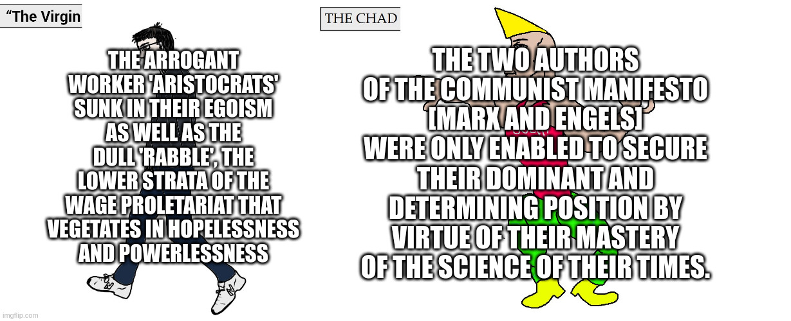

---
# valkuilen
<!-- source: https://geripal.org/goldilocks-and-hospice-care/ -->
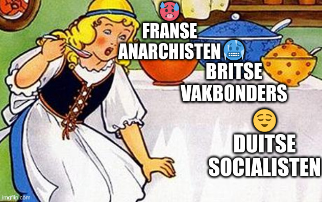

---
### inzicht & organisatie

- noodzaak van politieke vrijheid
- doel helpt bij tegenslag

---
# politieke vrijheid
> Om te strijden heb je eerst terrein, licht, lucht, en beweegruimte nodig.
(Engels)
- vvmu
- pers
- vereniging
- staken

<!-- 
---
# geen vvmu geen propaganda

## lenin 🤝 bourgeois
-->

---
### hegemonie v/d arbeidersklasse
- volkspartij neigt naar nationaal
- belangen arbeider in minimum-programma
- hegemonie strategie: liberale democratie moet door proletariaat

---
# hegemonie strategie
volgt uit stellingen van Sociaal Democratie:
1. noodzaak politieke vrijheid
2. ook tegen machtsmisbruik
3. bourgeois heeft eigen belangen

👉 dus zelf doen

---
#### Sociaal Democratie als goed nieuws
- kan bezit collectiviseren en loonarbeid afschaffen, i.t.t. opstand
- _wat moeten we doen_: educaten

---
<!-- # _What is to be done_: hoofdpunten -->
# _wa moeten we doen_: tl;dr
1. beweging in Rusland naar model SPD
1. ondergronds om politiestaat
1. politieke vóór socialistische revolutie
1. partij als revolutionaire voorhoede

---
# vragen
- hoe verschilden de omgevingen van Kautsky en Lenin?
- hoe verhield WITBD zich tot Kautsky?
<!-- - hoe is WITBD later misinterpreteerd? -->
- wat waren de contributies van Marx, Lasalle, Kautsky voor WITBD?
- als alles voorbestemd is, hoezo die moeite dan? relevantie vandaag?
- status politieke vrijheden vandaag?
- re: optimisme Marx/Kautsky?

---
# politieke vrijheden vandaag
- vvmu
- pers
- vereniging
- staken

---
# vvmu
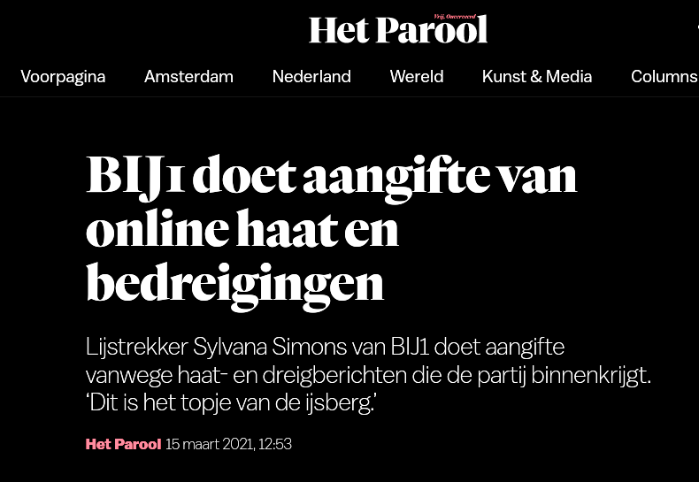

---
# pers
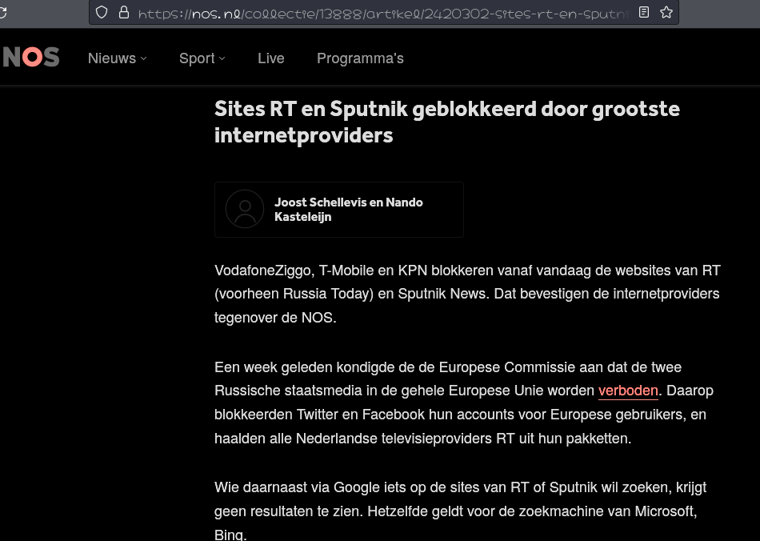

---
## vereniging
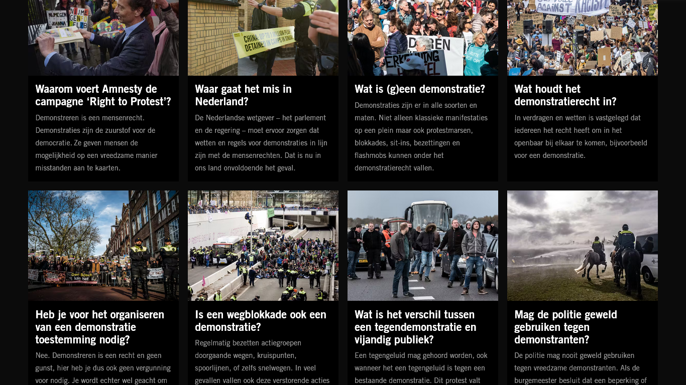

---
## staken
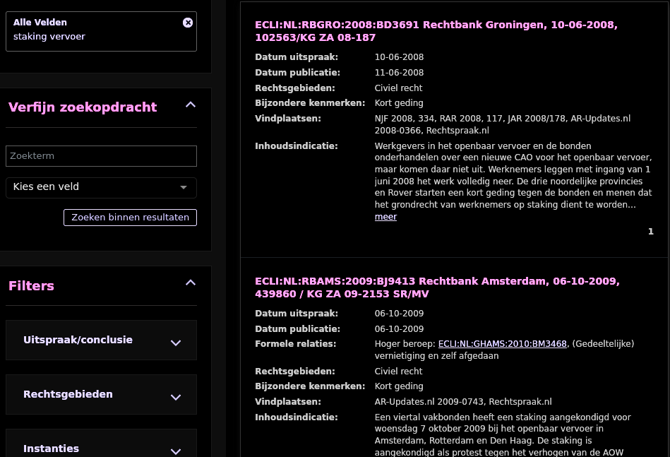

---
### politieke vrijheden vandaag
<!-- source: https://www.pngwing.com/en/free-png-zaoue -->
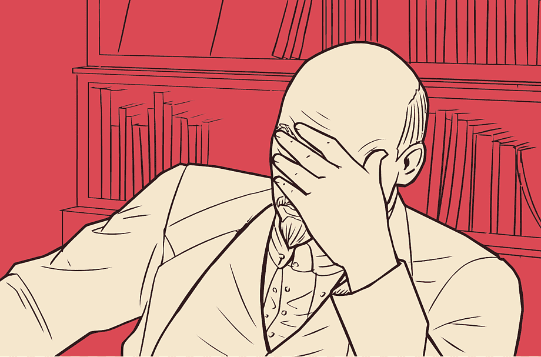
